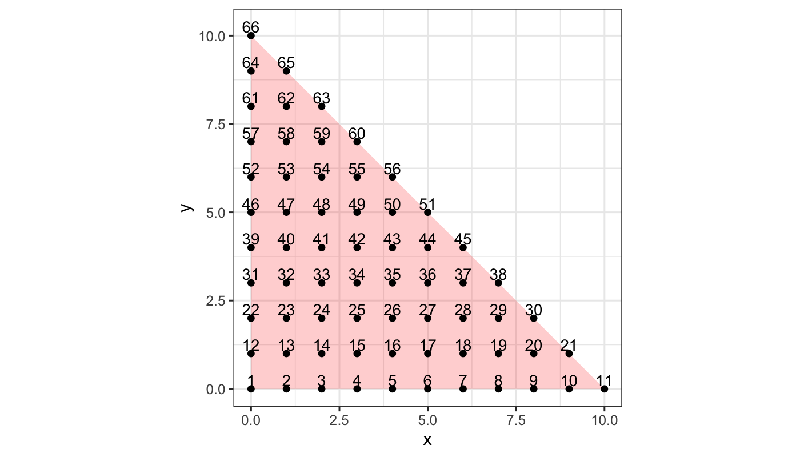

<!-- README.md is generated from README.Rmd. Please edit that file -->
latter
======

**latter** is an R package that makes back-end connections to [LattE](https://www.math.ucdavis.edu/~latte/software.php) and [4ti2](http://www.4ti2.de). Most of its functions were previously part of the [**algstat** package](https://github.com/dkahle/algstat), but have been pulled out and improved upon.

It is currently being developed.

*Note: the following assumes you have [LattE](https://www.math.ucdavis.edu/~latte/) and [4ti2](http://www.4ti2.de) installed and latter recognizes their path.*

``` r
library(latter)
#   LattE found in /Applications/latte/dest/bin
#   4ti2 found in /Applications/latte/dest/bin
```

Lattice point counting
----------------------

Most [LattE](https://www.math.ucdavis.edu/~latte/) programs are available as functions in **latter**. For example, `count()` uses LattE's `count` to determine the number of integer points in a [polytope](http://en.wikipedia.org/wiki/Polytope):

``` r
count(c("x + y <= 10", "x >= 0", "y >= 0"))
# [1] 66
```

It's easy to confirm the solution with a simple visualization:

``` r
library(ggplot2); theme_set(theme_bw())
polytope <- data.frame(x = c(0,10,0), y = c(0,0,10))
points   <- expand.grid(x = 0:10, y = 0:10)
points   <- subset(points, x + y <= 10)
points$number <- 1:nrow(points)
ggplot(aes(x = x, y = y), data = polytope) +
  geom_polygon(fill = "red", alpha = .2) + 
  geom_text(aes(y = y + .25, label = number), size = 3.5, data = points) +
  geom_point(data = points) + 
  coord_equal()
```



Integer programming
-------------------

In addition to table counting, it can also do integer programming with LattE's `latte-maximize` and `latte-minimize` programs. To do this, it uses tools from [**mpoly**](http://github.com/dkahle/mpoly):

``` r
latte_max("-2 x + 3 y", c("x + y <= 10", "x >= 0", "y >= 0"))
# $par
#  x  y 
#  0 10 
# 
# $value
# [1] 30
latte_min("-2 x + 3 y", c("x + y <= 10", "x >= 0", "y >= 0"))
# $par
#  x  y 
# 10  0 
# 
# $value
# [1] -20
```

We can check that the solution given above is correct, but the value is not. So, it needs some more work:

``` r
points$objective <- with(points, -2*x + 3*y)
ggplot(aes(x = x, y = y), data = polytope) +
  geom_polygon(fill = "red", alpha = .2) + 
  geom_point(aes(size = objective), data = points) + 
  coord_equal()
```


Installation
============

Installing latter
-----------------

-   From Github (dev version):

``` r
if (!("devtools" %in% installed.packages())) install.packages("devtools")
devtools::install_github("dkahle/mpoly")
devtools::install_github("dkahle/latter")
```

Installing supporting software
------------------------------

Coming soon! See the links above for direct information.
